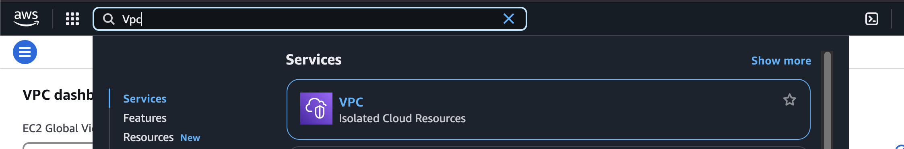
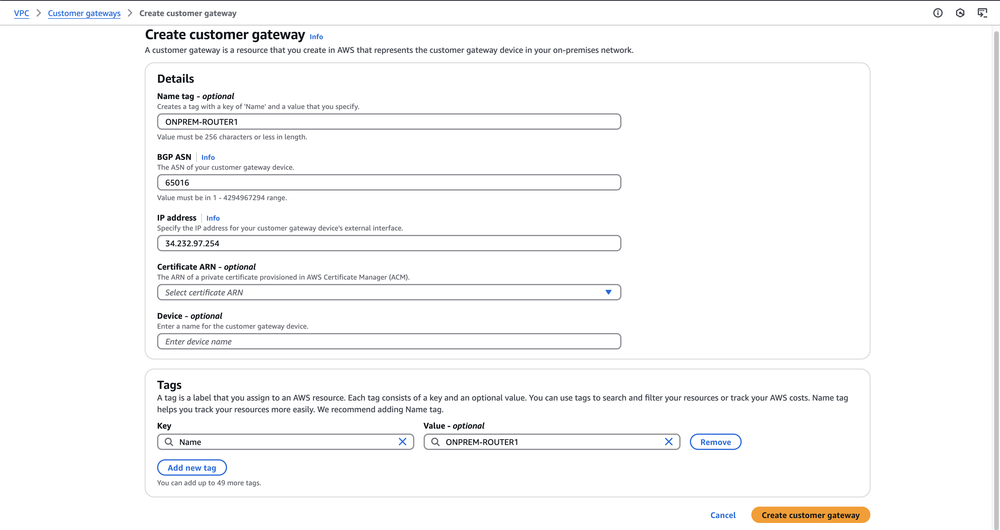
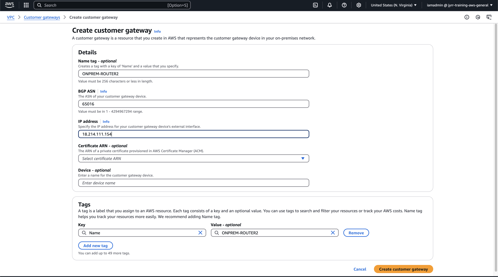
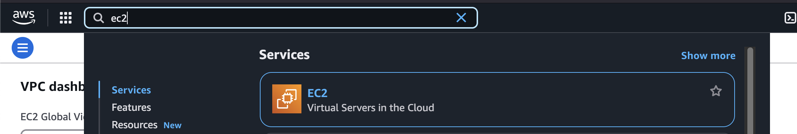
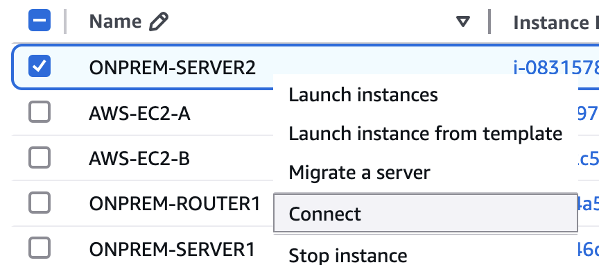
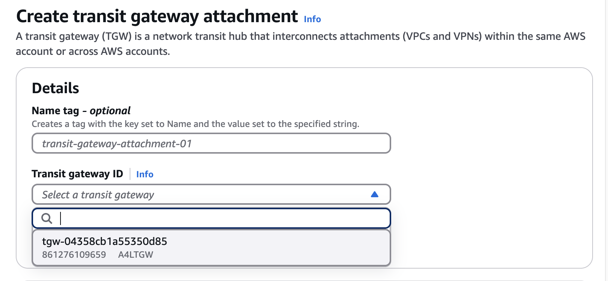
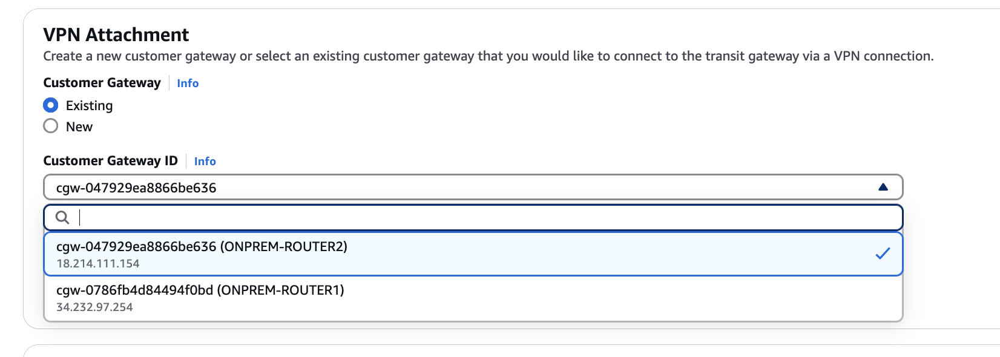
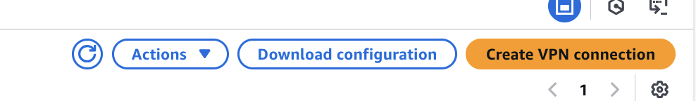
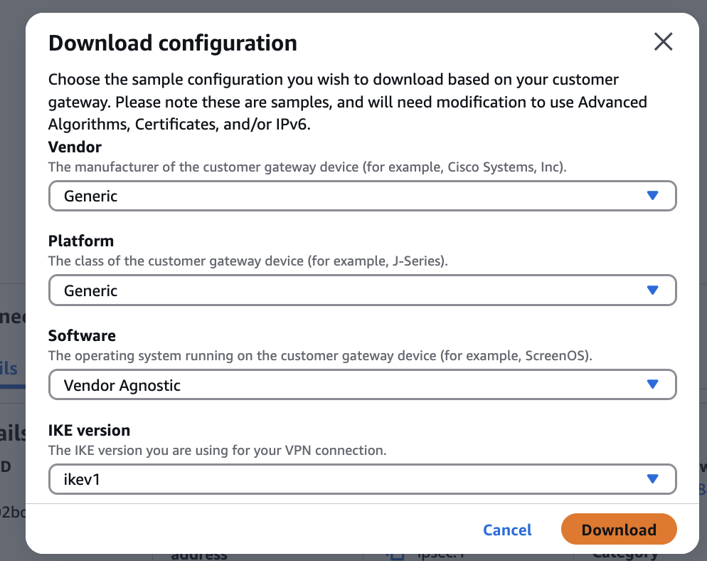

# Advanced Highly-Available Dynamic Site-to-Site VPN


## STAGE1 - AWS and ONPREM Setup
1. INITIAL SETUP OF AWS ENVIRONMENT AND SIMULATED ON-PREMISES ENVIRONMENT
    * Open 1 deployment setup: [CLICK THIS](https://learn-cantrill-labs.s3.amazonaws.com/aws-hybrid-bgpvpn/BGPVPNINFRA.yaml)
    * When stack is create completed, go to `Outputs` tab, note down IP value for the `Router1Public` and `Router2Public`
    Mine is:
        ```
        Router1Public: 34.232.97.254
        Router2Public: 18.214.111.154


2. CREATE CUSTOMER GATEWAY OBJECTS
* For ON-PREM ROUTER 1
    * Open VPC console 
    
    * On the humburger menu, Under `Virtual private network (VPN)`, Select `Customer Gateways` 
    * Click Create `Customer gateway`
    * Set Name to `ONPREM-ROUTER1`
    * Set BGP ASN to `65016`
    * Set IP Address to `Router1Public IP`
    * Click `Create Customer gateway`



* For ON-PREM ROUTER 2
    *  Click Create `Customer gateway`
    * Set Name to `ONPREM-ROUTER2`
    * Set BGP ASN to `65016`
    * Set IP Address to `Router2Public IP`
    * Click `Create Customer gateway`




3. CONFIRM NO CONNECTIVITY
    * Move to EC2 Console
    
    * Click `Instances` on the hamburger menu
    * Locate and select `ONPREM-SERVER2`
    * Right Click, click `Connect`
    
    * Select `Session Manager`
    * Click `Connect`
    * Open Instance `AWS-EC2-B`, copy its `Private IPv4 addresses`


    * run ping `IPv4_ADDRESS_OF_AWS_EC2-B`
    * It doesn't work ... because there's no connectivity.


## STAGE2 - TRANSIT GATEWAY VPN ATTACHMENTS
1. CREATE VPN ATTACHMENTS FOR TRANSIT GATEWAY
* Move back to VPC console, Under `Transit gateways`, click `Transit gateway attachments`
* For ONPREM-ROUTER1
    * Click `Create Transit Gateway Attachment`
    * Click `Transit Gateway ID` dropdown and select `A4LTGW`
    
    * Select `VPN` for attachment type
    * Select `Existing` for Customer gateway
    * Click `Customer gateway ID` dropdown and select `ONPREM-ROUTER1`
    * Click `Dynamic (requires BGP)` for Routing options
    * Click `Enable Acceleration`
    * Click `Create transit gateway attachment`


* For ONPREM-ROUTER2
    * Click `Create Transit Gateway Attachment`
    * Click `Transit Gateway ID` dropdown and select `A4LTGW`
    
    * Select `VPN` for attachment type
    * Select `Existing` for Customer gateway
    * Click `Customer gateway ID` dropdown and select `ONPREM-ROUTER2`
    
    * Click `Dynamic (requires BGP)` for Routing options
    * Click `Enable Acceleration`
    * Click `Create transit gateway attachment`

* Move to `Site-to-Site VPN Connections` under `Virtual Private Network`

    For each of the connections, it will show you the `Customer Gateway Address` these match `ONPREM-ROUTER1` Public and `ONPREM-ROUTER2` Public

* Select the line which matches `Router1PubIP`
    ```
        Router1Public: 34.232.97.254
        Router2Public: 18.214.111.154
* Click `Download Configuration`

* Change vendor to `Generic`

* Click `Download`
* Rename this file to `CONNECTION1CONFIG.TXT`
* Repeat the process for connection 2. Select the line which matches **Router2PubIP**
* Click `Download Configuration`
Change vendor to `Generic`
Click `Download`
Rename this file to `CONNECTION2CONFIG.TXT`

2. POPULATE DEMO VALUE TEMPLATE WITH ALL CONFIG VALUES
    * There is a document in this folder called `DemoValueTemplate.md` - it contains instructions on how to extract all of the configuration variables you will need
    You will extract these from three locations

        * Outputs of the ONPREM CFN Stack
        * For Connection1, CONNECTION1CONFIG.TXT
        * For Connection2, CONNECTION2CONFIG.TXT

    Go ahead and populate that template using the instructions in the template

