# Advanced Highly-Available Dynamic Site-to-Site VPN
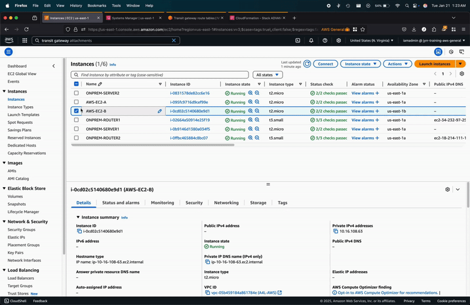


## STAGE1 - AWS and ONPREM Setup
### 1. INITIAL SETUP OF AWS ENVIRONMENT AND SIMULATED ON-PREMISES ENVIRONMENT
    * Open 1 deployment setup: [CLICK THIS](https://learn-cantrill-labs.s3.amazonaws.com/aws-hybrid-bgpvpn/BGPVPNINFRA.yaml)
    * When stack is create completed, go to `Outputs` tab, note down IP value for the `Router1Public` and `Router2Public`
    Mine is:
        ```
        Router1Public: 34.232.97.254
        Router2Public: 18.214.111.154


### 2. CREATE CUSTOMER GATEWAY OBJECTS
* For ON-PREM ROUTER 1
    * Open VPC console 
    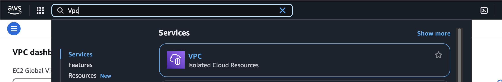
    * On the humburger menu, Under `Virtual private network (VPN)`, Select `Customer Gateways` 
    * Click Create `Customer gateway`
    * Set Name to `ONPREM-ROUTER1`
    * Set BGP ASN to `65016`
    * Set IP Address to `Router1Public IP`
    * Click `Create Customer gateway`

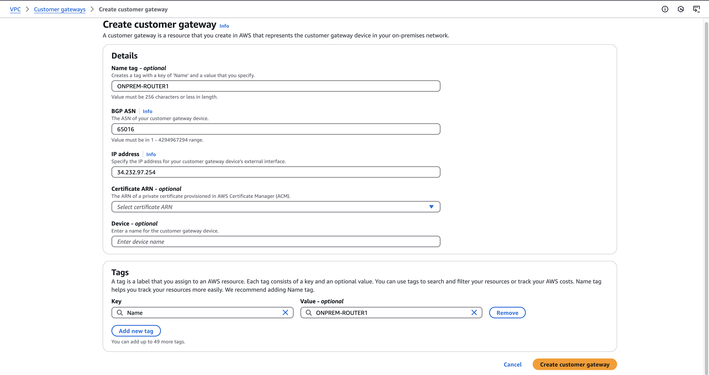

* For ON-PREM ROUTER 2
    *  Click Create `Customer gateway`
    * Set Name to `ONPREM-ROUTER2`
    * Set BGP ASN to `65016`
    * Set IP Address to `Router2Public IP`
    * Click `Create Customer gateway`

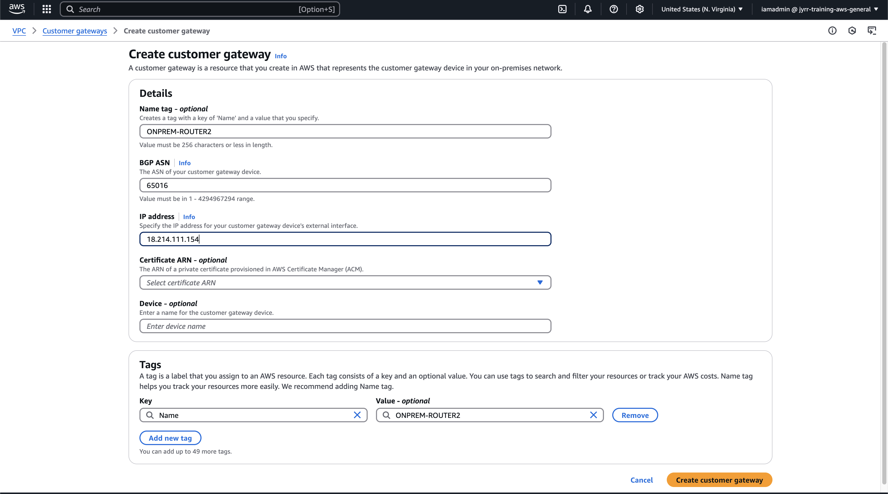


### 3. CONFIRM NO CONNECTIVITY
    * Move to EC2 Console
    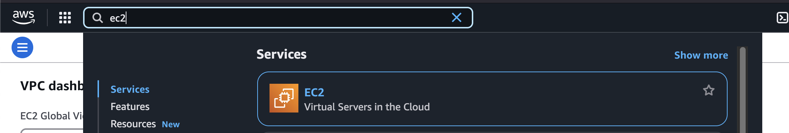
    * Click `Instances` on the hamburger menu
    * Locate and select `ONPREM-SERVER2`
    * Right Click, click `Connect`
    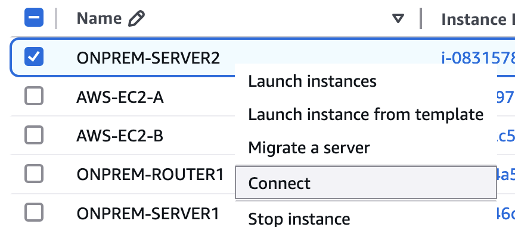
    * Select `Session Manager`
    * Click `Connect`
    * Open Instance `AWS-EC2-B`, copy its `Private IPv4 addresses`


    * run ping `IPv4_ADDRESS_OF_AWS_EC2-B`
    * It doesn't work ... because there's no connectivity.


## STAGE2 - TRANSIT GATEWAY VPN ATTACHMENTS
### 1. CREATE VPN ATTACHMENTS FOR TRANSIT GATEWAY
* Move back to VPC console, Under `Transit gateways`, click `Transit gateway attachments`
* For ONPREM-ROUTER1
    * Click `Create Transit Gateway Attachment`
    * Click `Transit Gateway ID` dropdown and select `A4LTGW`
    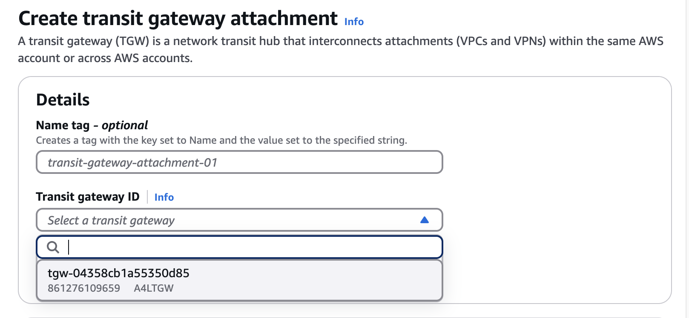
    * Select `VPN` for attachment type
    * Select `Existing` for Customer gateway
    * Click `Customer gateway ID` dropdown and select `ONPREM-ROUTER1`
    * Click `Dynamic (requires BGP)` for Routing options
    * Click `Enable Acceleration`
    * Click `Create transit gateway attachment`
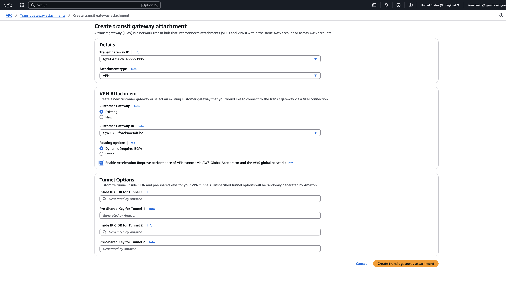

* For ONPREM-ROUTER2
    * Click `Create Transit Gateway Attachment`
    * Click `Transit Gateway ID` dropdown and select `A4LTGW`
    
    * Select `VPN` for attachment type
    * Select `Existing` for Customer gateway
    * Click `Customer gateway ID` dropdown and select `ONPREM-ROUTER2`
    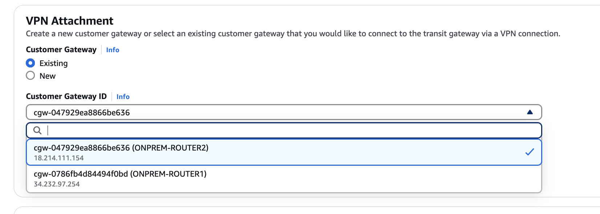
    * Click `Dynamic (requires BGP)` for Routing options
    * Click `Enable Acceleration`
    * Click `Create transit gateway attachment`

* Move to `Site-to-Site VPN Connections` under `Virtual Private Network`

    For each of the connections, it will show you the `Customer Gateway Address` these match `ONPREM-ROUTER1` Public and `ONPREM-ROUTER2` Public

* Select the line which matches `Router1PubIP`
    ```
        Router1Public: 34.232.97.254
        Router2Public: 18.214.111.154
* Click `Download Configuration`
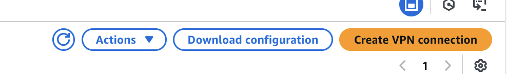
* Change vendor to `Generic`

* Click `Download`
* Rename this file to `CONNECTION1CONFIG.TXT`
* Repeat the process for connection 2. Select the line which matches **Router2PubIP**
* Click `Download Configuration`
Change vendor to `Generic`
Click `Download`
Rename this file to `CONNECTION2CONFIG.TXT`

### 2. POPULATE DEMO VALUE TEMPLATE WITH ALL CONFIG VALUES
There is a document in this folder called `DemoValueTemplate.md` - it contains instructions on how to extract all of the configuration variables you will need

You will extract these from three locations

        * Outputs of the ONPREM CFN Stack
        * For Connection1, CONNECTION1CONFIG.TXT
        * For Connection2, CONNECTION2CONFIG.TXT

Go ahead and populate that template using the instructions in the template

## Stage 3 -  IPSEC TUNNEL CONFIG
### 1. Move to EC2 console
* Click `Instances` on the hamburger menu
* Locate and select `ONPREM-ROUTER1`
* Right Click, select `Connect`
* Select `Session Manager`
* Click `Connect`
    * Type the following:
        ```
        sudo bash
        cd /home/ubuntu/demo_assets/
        nano ipsec.conf
        ```

 
   *This is is the file which configures the IPSEC Tunnel interfaces over which our VPN traffic flows.*
   
   As we are connected to Router 1 - This configures the ones for ROUTER1 -> BOTH AWS Endpoints

* Replace the following placeholders with the real values in the `DemoValueTemplate.md` document


        ROUTER1_PRIVATE_IP
        CONN1_TUNNEL1_ONPREM_OUTSIDE_IP
        CONN1_TUNNEL1_AWS_OUTSIDE_IP
        CONN1_TUNNEL1_AWS_OUTSIDE_IP
        and
        ROUTER1_PRIVATE_IP
        CONN1_TUNNEL2_ONPREM_OUTSIDE_IP
        CONN1_TUNNEL2_AWS_OUTSIDE_IP
        CONN1_TUNNEL2_AWS_OUTSIDE_IP
        
        ctrl+o to save, and ctrl+x to exit

    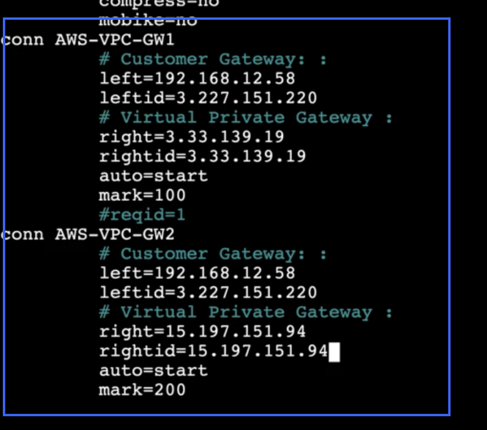

----

* type `nano ipsec.secrets`
    
    *This file controls authentication for the tunnels*

    Replace the following placeholders with the real values in the `DemoValueTemplate.md` document

        CONN1_TUNNEL1_ONPREM_OUTSIDE_IP
        CONN1_TUNNEL1_AWS_OUTSIDE_IP
        CONN1_TUNNEL1_PresharedKey
        and
        CONN1_TUNNEL2_ONPREM_OUTSIDE_IP
        CONN1_TUNNEL2_AWS_OUTSIDE_IP
        CONN1_TUNNEL2_PresharedKey
        
        Ctrl+o to save, and Ctrl+x to exit
   
 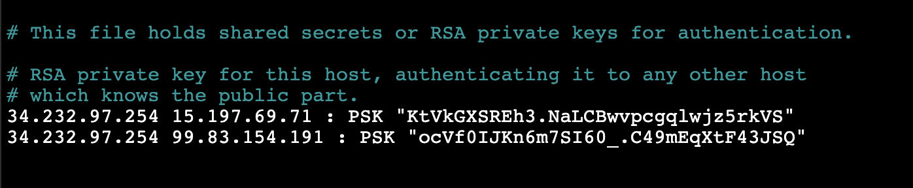

----

* Type `nano ipsec-vti.sh`

    *This script brings UP the IPSEC tunnel interfaces when needed*
    
    Replace the following placeholders with the real values in the `DemoValueTemplate.md` document
    
        CONN1_TUNNEL1_ONPREM_INSIDE_IP (ensuring the /30 is at the end)
        CONN1_TUNNEL1_AWS_INSIDE_IP (ensuring the /30 is at the end)
        CONN1_TUNNEL2_ONPREM_INSIDE_IP (ensuring the /30 is at the end)
        CONN1_TUNNEL2_AWS_INSIDE_IP (ensuring the /30 is at the end)
        
        Ctrl+o to save, and Ctrl+x to exit
----
    cp ipsec* /etc
    chmod +x /etc/ipsec-vti.sh

 Now all the configuration for Router1 IPSEC has been completed, lets restart the strongSwan service to bring them up.

* Type `systemctl restart strongswan` to restart strongSwan ... this should bring up the tunnels

* We can check these tunnels are up by running
`ifconfig`
* You should see `vti1` and `vti2` interfaces
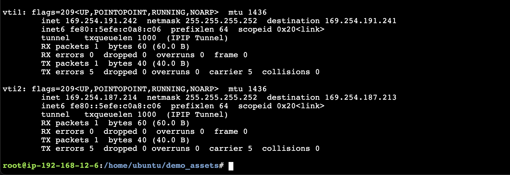
* You can also check the connection in the AWS VPC Console ...the tunnels should be down, but IPSEC should be shown as UP after a few minutes.
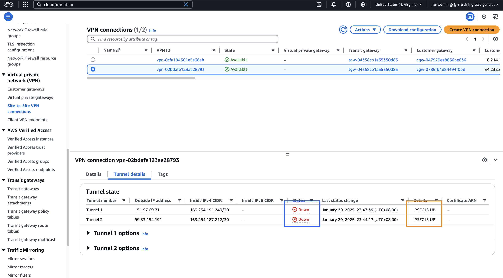

### 2. CONFIGURE IPSEC TUNNELS FOR ONPREMISES-ROUTER2
* Move to `EC2 Console`
* Click `Instances` on the hamburger menu
* Locate and select `ONPREM-ROUTER2`
* Right Click, select `Connect`
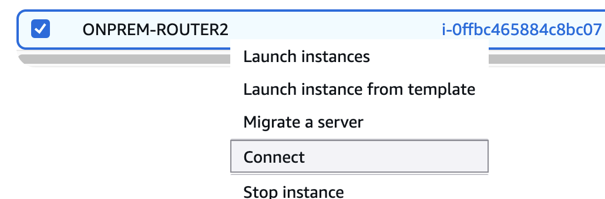
* Select `Session Manager`
* Click `Connect`
* Type the followingn:
    ```
    sudo bash
    cd /home/ubuntu/demo_assets/
    nano ipsec.conf
    ```

*This is is the file which configures the IPSEC Tunnel interfaces over which our VPN traffic flows.*

As we are connected to Router 2 - This configures the ones for ROUTER2 -> BOTH AWS Endpoints

* Replace the following placeholders with the real values in the `DemoValueTemplate.md` document
    ```
    ROUTER2_PRIVATE_IP
    CONN2_TUNNEL1_ONPREM_OUTSIDE_IP
    CONN2_TUNNEL1_AWS_OUTSIDE_IP
    CONN2_TUNNEL1_AWS_OUTSIDE_IP
    and
    ROUTER2_PRIVATE_IP
    CONN2_TUNNEL2_ONPREM_OUTSIDE_IP
    CONN2_TUNNEL2_AWS_OUTSIDE_IP
    CONN2_TUNNEL2_AWS_OUTSIDE_IP
    

    ctrl+o to save and ctrl+x to exit
    ```
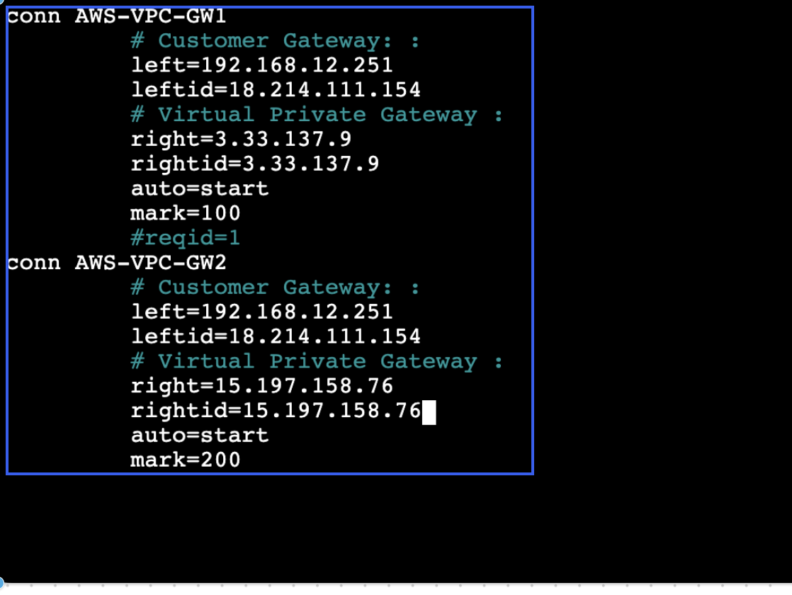
----
* Type `nano ipsec.secrets`

*This file controls authentication for the tunnels*
* Replace the following placeholders with the real values in the DemoValueTemplate.md document

        CONN2_TUNNEL1_ONPREM_OUTSIDE_IP
        CONN2_TUNNEL1_AWS_OUTSIDE_IP
        CONN2_TUNNEL1_PresharedKey
        and
        CONN2_TUNNEL2_ONPREM_OUTSIDE_IP
        CONN2_TUNNEL2_AWS_OUTSIDE_IP
        CONN2_TUNNEL2_PresharedKey

        Ctrl+o to save, and Ctrl+x to exit

----
* Type `nano ipsec-vti.sh`

*This script brings UP the tunnel interfaces when needed*

Replace the following placeholders with the real values in the DemoValueTemplate.md document

    CONN2_TUNNEL1_ONPREM_INSIDE_IP (ensuring the /30 is at the end)
    CONN2_TUNNEL1_AWS_INSIDE_IP (ensuring the /30 is at the end)
    CONN2_TUNNEL2_ONPREM_INSIDE_IP (ensuring the /30 is at the end)
    CONN2_TUNNEL2_AWS_INSIDE_IP (ensuring the /30 is at the end)
    
    Ctrl+o to save, and Ctrl+x to exit
----
    cp ipsec* /etc
    chmod +x /etc/ipsec-vti.sh

Now all the configuration for Router1 IPSEC has been completed, lets restart the strongSwan service to bring them up.

systemctl restart strongswan to restart strongSwan ... this should bring up the tunnels

We can check these tunnels are up by running
ifconfig
You should see `vti1` and `vti2` interfaces
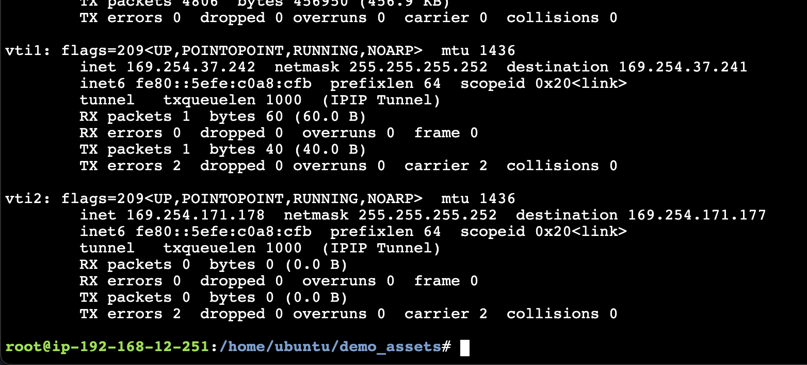

You can also check the connection in the AWS VPC Console ...the tunnels should be down, but IPSEC should be shown as UP after a few minutes.


## Stage 4 - BGP ROUTING AND TESTING
### 1. INSTALL FRR ON ROUTER 1
* Move to EC2 Console
* Click `Instances` on the hamburger menu
* Locate and select `ONPREM-ROUTER1`
* Right Click, select `Connect`
* Select `Session Manager`
* Click `Connect`

First we will make the FRR script executable and run it to install BGP capability.

    sudo bash
    cd /home/ubuntu/demo_assets
    chmod +x ffrouting-install.sh
    ./ffrouting-install.sh

*This will take some time - 10-15 minutes**

*We can allow this to run, and start the same process on the other Router*

### 2. INSTALL FRR ON ROUTER 2
* Move to EC2 Console
* Click `Instances` on the hamburger menu
* Locate and select `ONPREM-ROUTER1`
* Right Click, select `Connect`
* Select `Session Manager`
* Click `Connect`

First we will make the FRR script executable and run it to install BGP capability.

    sudo bash
    cd /home/ubuntu/demo_assets
    chmod +x ffrouting-install.sh
    ./ffrouting-install.sh


### 3. CONFIGURE BGP ROUTING FOR ONPREMISES-ROUTER1 AND TEST
Type the following

    sudo bash
    vtysh
    conf t
    frr defaults traditional
    router bgp 65016
    neighbor CONN1_TUNNEL1_AWS_BGP_IP remote-as 64512
    neighbor CONN1_TUNNEL2_AWS_BGP_IP remote-as 64512
    no bgp ebgp-requires-policy
    address-family ipv4 unicast
    redistribute connected
    exit-address-family
    exit
    exit
    wr
    exit

    sudo reboot

ONPREM-ROUTER1 once back will now be functioning as both an IPSEC endpoint and a BGP endpoint. It will be exchanging routes with the transit gateway in AWS.
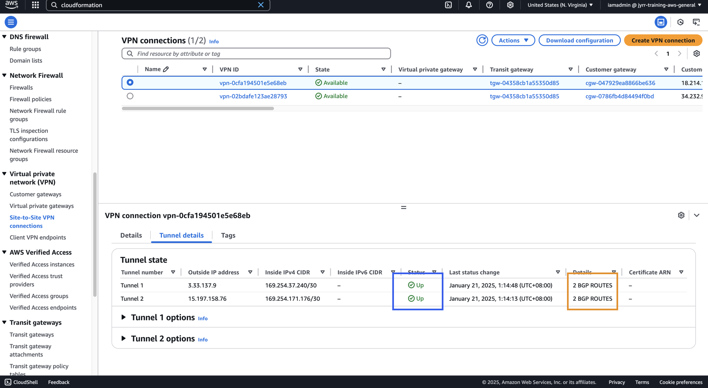
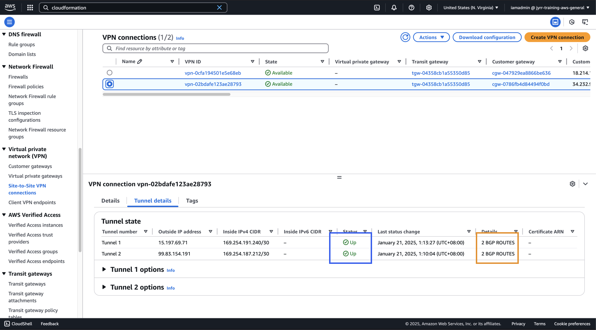

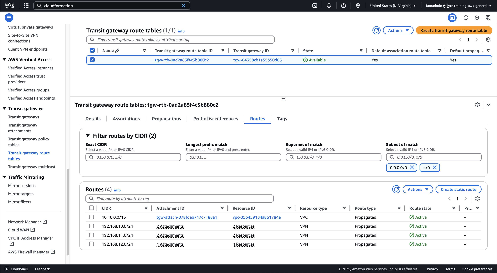

Locate and select ONPREM-ROUTER1
Right Click => Connect
Select Session Manager
Click Connect
sudo bash

SHOW THE ROUTES VIA THE UI route
SHOW THE ROUTES VIA vtysh
show ip route.
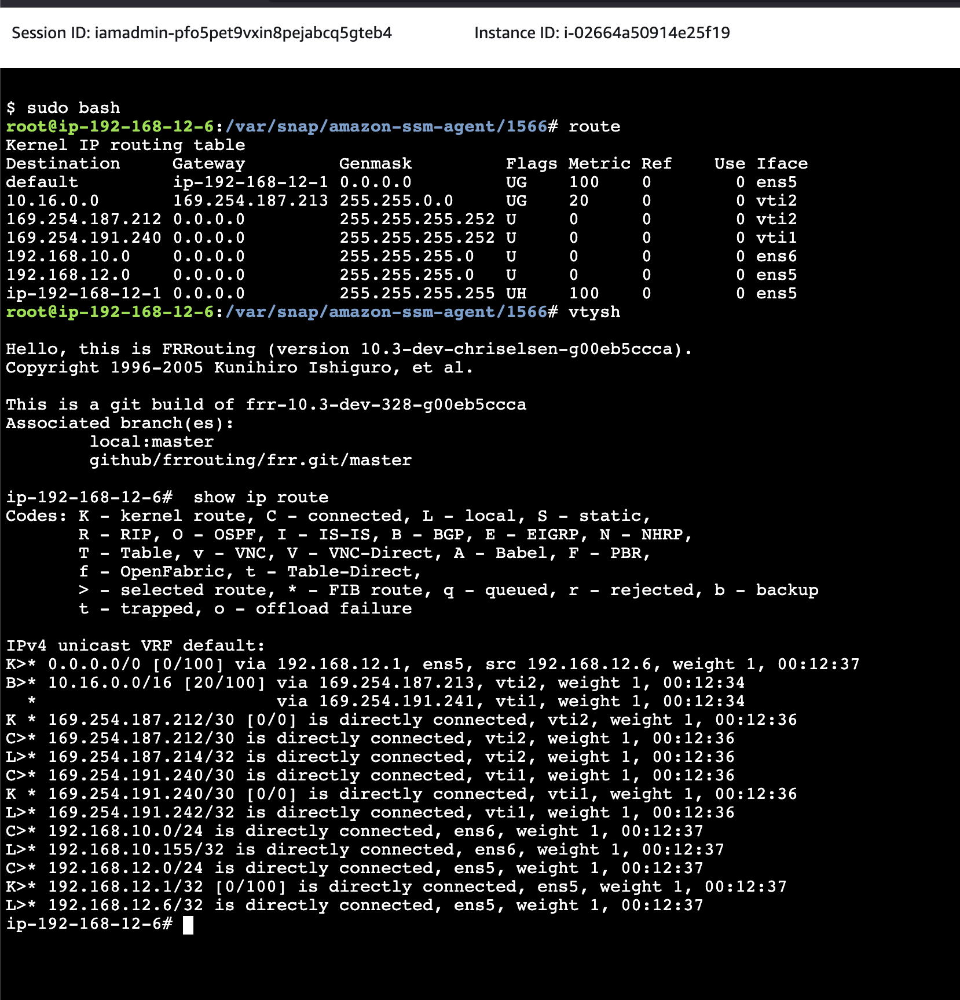

### 4. TEST
#### 1. Move to EC2 Console
https://console.aws.amazon.com/ec2/v2/home?region=us-east-1#Instances:sort=instanceState
* Click `Instances` on the left menu
* Locate and select `ONPREM-SERVER1`
* Right Click => `Connect`
* Select `Session Manager`
* Click `Connect`

* run `ping IP_ADDRESS_OF_EC2-A`

#### 2. Move to EC2 Console
https://console.aws.amazon.com/ec2/v2/home?region=us-east-1#Instances:sort=instanceState
* Click `Instances` on the left menu
* Locate and `select EC2-A`
* Right Click => `Connect`
* Select `Session Manager`
* Click `Connect`

* run `ping IP_ADDRESS_OF_ONPREM-SERVER1`

## CLEANUP
### 1. Move to VPC console
* Click `Site-to-Site VPN connections`
* Select each VPN
* Click `Actions`
* Select `Delete VPN connection`
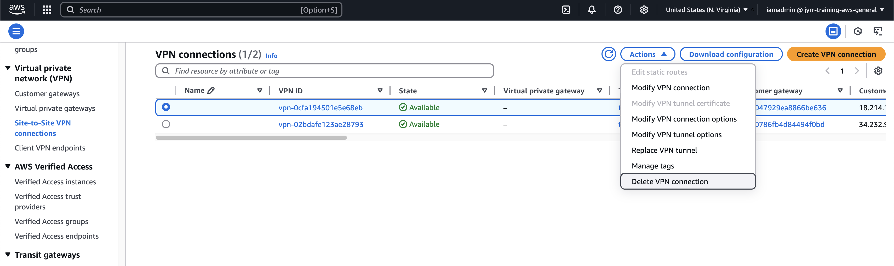
* confirm deletion 

</br>

* Click `Customer gateways`
* Select each gateway
* Click `Actions`
* Select `Delete customer gateway`
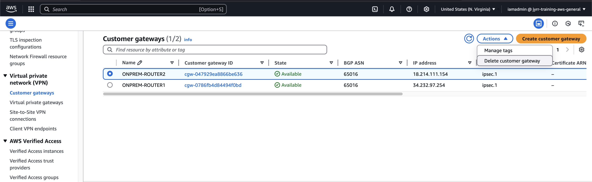
* Confirm deletion


### 2. Go to CloudFormation
* Select 1 click deployment stack, `ADVANCEDVPNDEMO`
* Click `delete`


## Conclusion
CONGRATULATIONS!

You've successfully completed a complex implementation of a Site-to-Site VPN between AWS and a simulated on-premise environment. This hands-on experience is invaluable and can be applied to real-world deployment scenarios. 

Key components of your implementation include:

* `Transit Gateway with VPN Attachments`

* `VPN Accelerator`: Leveraging the Global AWS Network to transit traffic from customer routers to the Transit Gateway

* `BGP` (Border Gateway Protocol): Dynamically exchanging routes between customer routers and the Transit Gateway

* `True Dynamic Routing and High Availability`: Using four IPSec tunnels between customer routers and each of the four AWS side endpoints

This achievement marks a significant milestone in your understanding and capability to manage hybrid cloud environments. 


Credits:

*This project is based on the Solutions Architect Professional course by Adrian Cantrill. Their comprehensive guides and learning resources have been instrumental in the development of this application.*